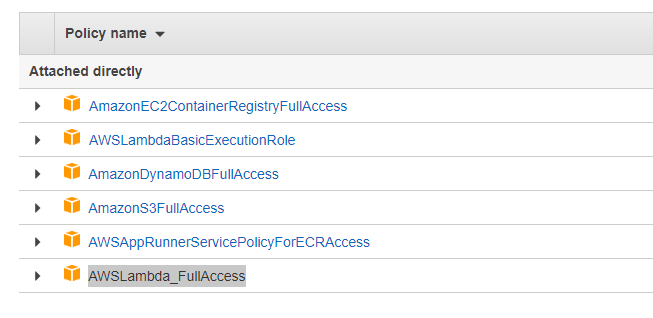
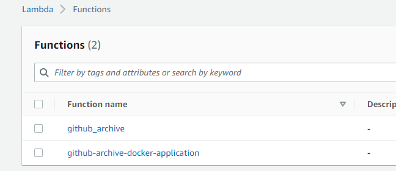
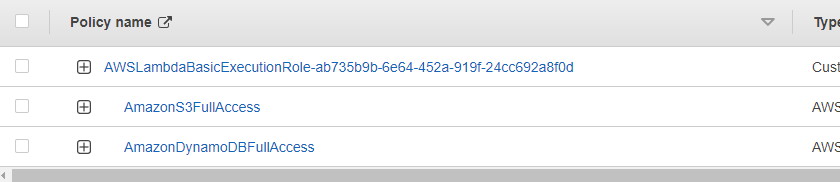
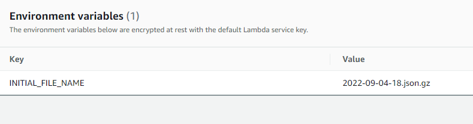

# serverless_pipelines_using_lambda

## Resources
1. [DynamoDB Resource](https://highlandsolutions.com/blog/hands-on-examples-for-working-with-dynamodb-boto3-and-python)
2. [AWS_Documentation_for_ECR_Python](https://docs.aws.amazon.com/lambda/latest/dg/python-image.html)

## Requirements
1. Create User with the access to Dynamodb, S3, lambda, ECR

2. Create two lambda functions with the below name

3. Provide the following permission for lambda role

4. AWS lambda - environment variables

